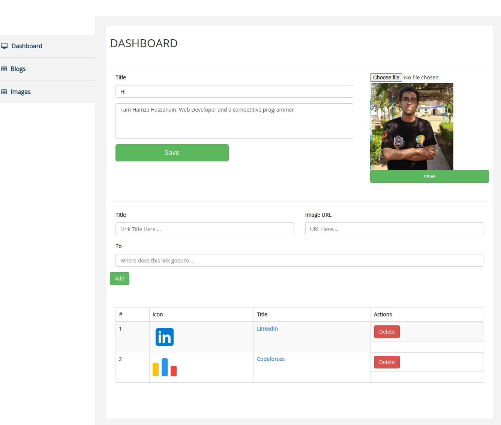
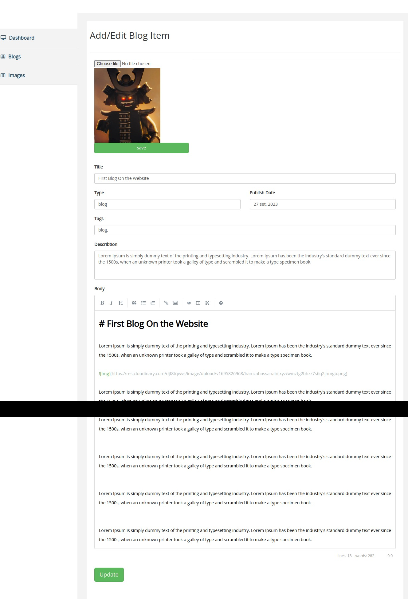
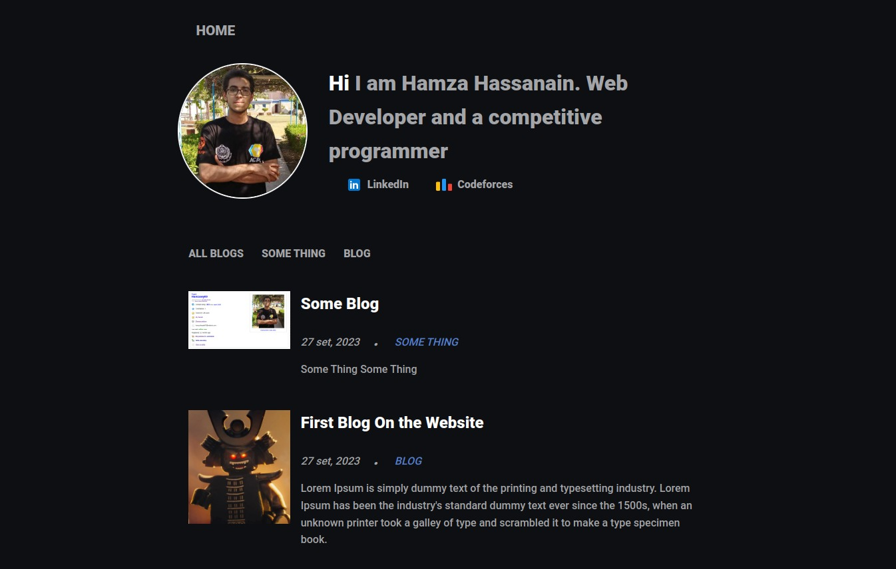
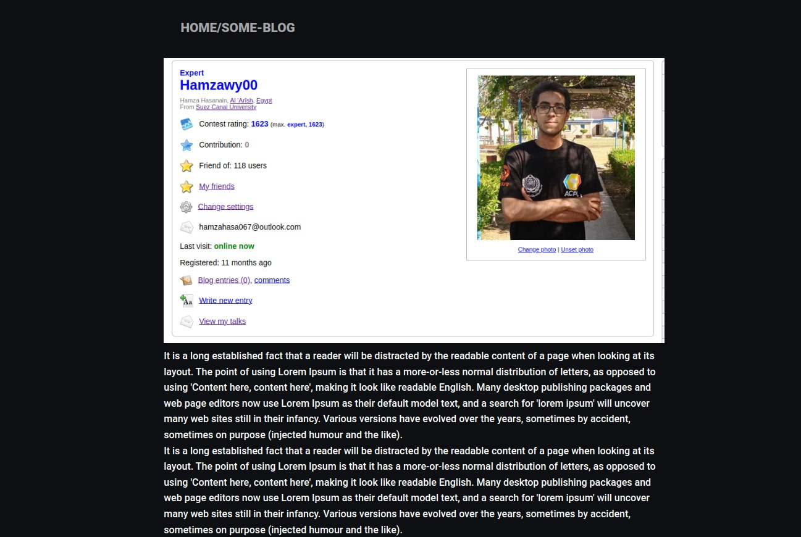

# Personal Blogging Website

### Main Features

- Developed a Full-Stack Personal Blogging application using Express.js, React.js, and MongoDB.
- Developed an Admin panel using EJS, CSS, and JavaScript to enable editing of hero sections, including image uploading and writing brief intros.
- Integrated Cloudinary cloud storage to create a fast, reliable, and scalable image-uploading system.
- Created an advanced blog editor with options to edit blog details and the main blog body using either. an advanced editor or Markdown, which is parsed and sanitized into HTML and saved in the database. 
- Developed a REST API for seamless data retrieval from the database
- Utilized React, React Router, JSX, and CSS to create an aesthetically pleasing front-end for the website
- Leveraged Axios to interact with the backend API

### How to Get Started with the application:

First Make sure you are inside the client directory and run the following command:

```bash
git clone https://github.com/HamzaHassanain/Personal-Blogging-Application.git

cd Personal-Blogging-Application
```

Now you have two folders one for the server and the other for the client.

#### The Server:

```bash
cd Server
```

Then follow the instructions in the README.md file. (You can find it in the Server directory)

#### The Client:

```bash
cd Client
```

Then follow the instructions in the README.md file. (You can find it in the Client directory)

### How the website looks like:

#### Backend Admin Panel:






#### Front-end:




